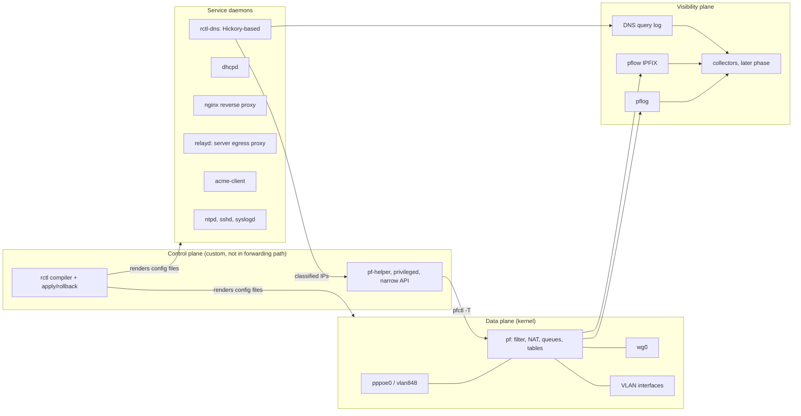

# Octopus: changes to this design (2026-10-01)

The document below is the original design (v1.0). Octopus implements it
with these deviations and decisions; everything else stands as written.

| Topic | Design | Octopus | Why |
|---|---|---|---|
| Name | `rctl` placeholder | project **Octopus**: `octopus` CLI, `octopus-dns`, `octopus-pfhelper`, `octopus-web`; rc names `octopus_*`; `/etc/octopus`, `/var/octopus` | owner's name |
| Web UI | "no PHP or web UI stack" | a small Rust UI (`octopus-web`, x11 look) | owner asked for a front-end in the x11 design. It runs as `_octoweb`, pledged/unveiled, HTTPS on mgmt addresses only (INV-1), bcrypt logins, CSRF/Origin checks, strict CSP. It never holds root or secrets: status/diff/apply/confirm/rollback go through five exact `doas` rules to the `octopus` CLI, which rebuilds the staged router.toml from scratch |
| Real network | VLAN trunk, mgmt/lan/servers | the imported router has three flat ports (192.168.1/24 mgmt, 192.168.2/24, 192.168.8/21) | faithful import; VLANs and `servers` remain available (`examples/vlans.toml`) |
| Policy order | per network | per network: reflection → mgmt guard (INV-1) → DoT block (INV-4) → explicit `[[rules]]` (first match) → kind policy; everything after `block log all` is `quick` | keeps imported pfSense rule order meaningful |
| DoH canary, phase A | NXDOMAIN | NODATA from an empty zone (Firefox disables DoH on both); phase B answers NXDOMAIN | hickory's blocklist returns 0.0.0.0, which would not disable DoH |
| Download queues | parent or per interface | trees on each physical port; VLANs share their parent's | pf refuses queues on interfaces that don't exist yet, and new VLANs are created after validation |
| IPv6 | full or blocked | blocked; `mode = "pd"` fails the build | not implemented; never half-configured |
| Apply | atomic per subsystem | plus: generation 0 = pre-Octopus baseline; watchdog process; `octopus boot` reverts after a reboot; any failure reverts at once; `/etc/octopus/router.toml` follows the live generation | rollback must also work for the first apply and across reboots |
| Validation | native parsers | as designed, plus off-router modes (`--offline`): queues and leaf certificates are substituted when the machine lacks the interfaces/certs; nginx -t tolerates addresses the generation itself creates | CI on the build VM |
| PKI | rcgen | rcgen 0.14 (ring); both CA levels carry critical nameConstraints (DNS: internal zone; IP: internal ranges + WireGuard); leaves 90 d; also used for the web UI | as designed |
| nginx | reverse proxy | `[[vhosts]]`: internal names with services leaves, public names on the WAN with Let's Encrypt (acme-client) or an own certificate, optionally Cloudflare's ranges only; package shipped in the site set | owner: public sites behind Cloudflare, several subdomains to different inside hosts |
| pf helper socket | Unix socket | `/var/run/octopus-pfhelper.sock`, root:_octodns 0660, peer uid/gid checked | |
| Users | `_hickory` | `_octodns` (860), `_octoweb` (861) | one DNS user for both phases |
| Servers' proxy | relayd with TLS inspection | **octopus-proxy** (rustls + hyper): SNI allowlist, origin certificate verified with SNI, leaves from a separate signer process that alone holds the interception root's key, Host must equal the SNI | relayd pre-connects upstream *without* SNI, so SNI-hosted origins present the wrong certificate and the wrong-host test can't work; it also only loads RSA keys |
| Interception root | ECDSA, password on the router | ECDSA via rcgen, no password: the key is read once by root and lives only in the pledged signer | no daemon could use a password without holding it |
| DNS upstreams | one set | `[[dns.views]]`: per-client upstreams with their own cache and no fallback; default = Cloudflare security | owner's request |
| IPv6 | full or blocked | full: dhcp6leased with fixed slots, ULA per network for the router's services, rad, v6 policy; `advertise_dns` off by default | implemented 2026-10-01 |
| Networks | VLANs | `bridge = [ports]` (veb/vport) for several ports as one network without VLANs; `dhcp.ranges` | owner's request |
| Collector | on the log VM | on the router (`pflow = "127.0.0.1:2055"`), DNS answers joined in memory, one JSON line per flow to syslog, which forwards to the log VM | nothing else needs IPFIX; the join is cheapest where the DNS answers are |
| pf log | pflog to the log VM | `octopus_filterlog` (tcpdump → logger) as program `filterlog` over the same syslog TLS | one transport |
| Networks | one network per port or VLAN, fixed kinds | tiers: every house port one bridge; devices placed by MAC (Kea classes), cable or Wi-Fi VLAN; open tiers with the policy as ordinary rules; a guard cutting off devices that take a listed-only tier's address | owner's decision 2026-10-02: easy to manage, the same source address everywhere |
| DHCP | dhcpd | Kea (package), as on pfSense | MAC prefixes need client classes |
| Access points | — | OpenWrt access points configured over SSH from `[wifi]` (SSIDs onto networks, guest networks as VLANs on the bridge); images from OpenWrt's Image Builder with the router's key | owner's request |
| Not yet | | LTE failover | |

---

# Custom OpenBSD Router: Design Document

Version 1.0, 30 September 2026
Audience: the implementing agent(s) and the owner, who reviews all privileged code.

## 1. Purpose and scope

This document defines a replacement for the current pfSense installation on a home/lab edge router. The goals are a small, auditable system that does exactly what the owner wants, has no PHP or web UI stack, is configured from one declarative file, and can be updated underneath without breaking the custom layer.

The router is OpenBSD with base-system daemons wherever possible. Custom Rust code does not forward packets. It compiles configuration, adds DNS-driven classification, and provides visibility tooling. Anything not listed in this document is out of scope unless the owner adds it.

## 2. Ground rules for the implementing agent

| ID | Rule |
|---|---|
| R1 | Never implement a kernel component, network stack, TLS stack, PPPoE client, HTTP parser or DNS wire parser. Use the components in section 5. |
| R2 | The config tool is a **compiler, not a runtime**. It renders plain OpenBSD config files and exits. If any custom daemon dies, forwarding, NAT and firewalling continue with the last applied config (fail static). |
| R3 | Only write files the OS treats as local configuration: `/etc/pf.conf` and anchors, `/etc/hostname.*`, daemon configs, `/etc/rc.conf.local` (only via `rcctl`), and custom `/etc/rc.d/` scripts. Never edit `/etc/rc.conf` or anything installed by base sets. |
| R4 | Interact with the OS through stable CLIs and config syntax (`pfctl`, `rcctl`, `ifconfig`, `sh /etc/netstart`). Do not use `/dev/pf` ioctls or other private kernel interfaces. |
| R5 | Validate every generated file with its owning daemon's parser before applying (section 7.3). |
| R6 | Any process that parses network input runs unprivileged, chrooted where possible, with `pledge(2)`/`unveil(2)`. Privileged actions go through `pf-helper` (section 7.5), which exposes a narrow, validated API. |
| R7 | Secrets never go in the repository or the agent's context. Use a separate `secrets.toml` referenced by key name. Redact the pfSense `config.xml` before an agent sees it. |
| R8 | The owner reviews anything that runs as root, the PKI code and the compiler's invariant checks. Fuzz every parser of external input (`cargo-fuzz`). |
| R9 | Rebuild all custom binaries for each OpenBSD release in the matching build VM. OpenBSD does not keep binary compatibility across releases. Never copy binaries between releases. |

## 3. Environment

| Item | Value |
|---|---|
| ISP / access | VDSL through a bridge-only modem; PPPoE on the router. |
| WAN encapsulation | 802.1Q VLAN 848 → PPPoE, MTU 1492, TCP MSS clamp 1452. Confirm from the pfSense `config.xml`. |
| Line rate | 100/25 Mbit/s nominal. Measure the real throughput before setting queue rates. |
| Hardware | Intel Atom mini PC, currently running pfSense. Exact model, NIC chips and AES-NI presence are **TBD** (section 20). |
| OS | OpenBSD 7.9 amd64 (released 19 May 2026). The next release is expected roughly six months later. Plan to upgrade to it, since it will be the first real test of the design. |
| Proxmox host | Hosts the OpenBSD build VM (same release as the router) and a log-storage VM. |
| IPv6 | Owner decision pending (section 21). Either implement fully or block completely. Never half-configure. |

## 4. Architecture overview



`rctl` is a placeholder name for the config compiler; the owner may rename the project.

## 5. Component map

| Role | Component | Source | Notes |
|---|---|---|---|
| OS | OpenBSD 7.9 | base | Updated with `syspatch`, upgraded with `sysupgrade`. |
| WAN | `vlan(4)` + `pppoe(4)` | base | `hostname.vlan848`, `hostname.pppoe0`. |
| Firewall, NAT, shaping | `pf` | base | Static main ruleset. Dynamic content lives only in tables and anchors. |
| DHCPv4 + MAC reservations | `dhcpd(8)` | base | `host { hardware ethernet; fixed-address; }` |
| IPv6 (if enabled) | `dhcp6leased(8)` + `rad(8)` | base | Prefix delegation on `pppoe0`, router advertisements on LANs. |
| DNS | Hickory DNS 0.26.x | custom build | Phase A: stock `hickory-dns` binary. Phase B: custom daemon `rctl-dns` embedding `hickory-server` (section 11). |
| VPN | `wg(4)` | base | Configured in `hostname.wg0`. No extra tooling. |
| Reverse proxy | nginx | package | The only mandatory package. |
| Public certificates | `acme-client(1)` | base | http-01 through an nginx webroot. |
| Server egress proxy | `relayd(8)` with TLS inspection | base | Servers network only (section 13). |
| PKI tooling | `rcgen` crate in `rctl`; LibreSSL `openssl(1)` as fallback | custom / base | Section 14. |
| Logs | `syslogd(8)` (TLS forwarding), `pflog(4)` + `pflogd` | base | Forwarded to the log VM on Proxmox. |
| Flow export | `pflow(4)` (IPFIX) | base | Collector in a later phase. |
| Time | `ntpd(8)` | base | Serves internal networks. |
| Management | `sshd(8)` | base | Bound to management addresses only. |
| Privileged table updates | `pf-helper` | custom | Section 7.5. |

## 6. Network layout

VLAN IDs and CIDRs below are placeholders. The owner finalizes them in `router.toml`.

| Network | VLAN | Example CIDR | Purpose | Default traffic class |
|---|---|---|---|---|
| `wan` | 848 (to the modem) | PPPoE | Internet | — |
| `mgmt` | 10 | 10.10.0.0/24 | Router and infrastructure management | default |
| `lan` | 20 | 10.20.0.0/24 | Owner's personal devices | default |
| `servers` | 30 | 10.30.0.0/24 | Servers with a strict no-external-access policy | bulk |
| `wg` | — | 10.99.0.0/24 | WireGuard peers; each peer mapped to `mgmt` or `lan` policy | per peer |

### 6.1 Policy matrix

| From \ To | Internet | Router services | mgmt | lan | servers |
|---|---|---|---|---|---|
| wan | — | WireGuard port only, plus nginx 80/443 if public vhosts exist | deny | deny | deny |
| mgmt | allow | all, including sshd | — | allow | allow |
| lan | allow (classified) | DNS, DHCP, NTP, nginx | deny | — | per explicit rule |
| servers | **only** via relayd (80/443) and explicit `[[links]]` | DNS, DHCP, NTP | deny | replies only | — |
| wg peer | per mapped policy | per mapped policy | only if peer mapped to mgmt | per mapped policy | per mapped policy |

## 7. Configuration model and control plane (`rctl`)

### 7.1 Inputs

`router.toml` is the single source of truth and is committed to the repository. `secrets.toml` holds PPPoE credentials, WireGuard private keys and CA key passphrases. It is never committed and never given to an agent. It is referenced by key name. The sketch below is illustrative; the agent designs the final schema.

```toml
[system]
hostname = "gw"
internal_domain = "home.arpa"          # or int.<owned-domain>.cz, owner decision
openbsd_release = "7.9"

[interfaces.wan]
mac = "00:00:00:00:00:01"              # roles bind to MACs; names resolved at compile time
vlan = 848
pppoe = { user = "secret:pppoe_user", password = "secret:pppoe_pass", mtu = 1492, mss = 1452 }

[interfaces.trunk]
mac = "00:00:00:00:00:02"

[[networks]]
name = "servers"
parent = "trunk"
vlan = 30
cidr = "10.30.0.1/24"
default_class = "bulk"
egress = "proxy-only"

[[dhcp.reservations]]
network = "lan"
mac = "aa:bb:cc:dd:ee:ff"
ip = "10.20.0.50"
hostname = "tv"

[[traffic.destinations]]
class = "streaming"
domains = ["googlevideo.com", "nflxvideo.net", "ttvnw.net"]   # suffix match

[[traffic.destinations]]
class = "bulk"
domains = ["deb.debian.org", "download.docker.com", "objects.githubusercontent.com", "s3.amazonaws.com"]

[[proxy.allow]]
network = "servers"
hosts = ["deb.debian.org", "security.debian.org", "*.s3.eu-central-1.amazonaws.com"]

[[links]]                               # direct egress exceptions for servers
network = "servers"
to = "203.0.113.10"
proto = "tcp"
port = 22
```

### 7.2 Pipeline

1. Load `router.toml` and resolve secrets by reference.
2. Resolve interface roles to OpenBSD interface names by MAC address. The names differ between the VM (`vio0`) and the hardware (`em0`, `igc0`, `re0`).
3. Check the invariants (7.4). Any violation aborts the run.
4. Render the target files into a new generation directory, for example `/var/rctl/generations/<n>/`.
5. Validate each file with its native parser (7.3).
6. Apply atomically per subsystem, then start a **commit-confirmed timer** (default 60 s). If the owner doesn't run `rctl confirm` in time, the previous generation is re-applied automatically.
7. The same pipeline runs in the build VM as CI, including all validators, against the matching OpenBSD release.

### 7.3 Outputs, validators, reload

Check the exact flags against the OpenBSD 7.9 man pages.

| Output | Validator | Apply |
|---|---|---|
| `/etc/hostname.*` | compiler checks | `sh /etc/netstart <if>` |
| `/etc/pf.conf` + anchor files | `pfctl -nf` | `pfctl -f` (atomic) |
| `/etc/dhcpd.conf` | `dhcpd -n` | `rcctl restart dhcpd` |
| DNS config + zone files | `hickory-dns --validate` (phase A) / `rctl-dns --validate` (phase B) | `rcctl restart rctl_dns` |
| `/etc/nginx/nginx.conf` | `nginx -t` | `rcctl reload nginx` |
| `/etc/relayd.conf` | `relayd -n` | `rcctl reload relayd` |
| `/etc/acme-client.conf` | `acme-client -n` | none |
| `/etc/ntpd.conf` | `ntpd -n` | `rcctl restart ntpd` |
| `/etc/ssh/sshd_config` | `sshd -t` | `rcctl reload sshd` |
| `/etc/syslog.conf` | compiler checks | `rcctl restart syslogd` |
| `/etc/rc.conf.local` | — | only via `rcctl enable/set` |

### 7.4 Invariants (compile fails if violated)

| ID | Invariant |
|---|---|
| INV-1 | sshd and any admin interface listen only on management addresses. pf has no pass rule to router management ports from any non-mgmt network or the WAN. |
| INV-2 | WAN inbound is default-deny. The only exceptions are the WireGuard port and, if public vhosts exist, nginx 80/443. No `rdr-to` to internal hosts unless explicitly declared. |
| INV-3 | The `servers` network has no direct internet egress except 80/443 diverted to relayd and declared `[[links]]`. |
| INV-4 | Clients cannot reach external DNS. TCP/UDP 53 and TCP 853 to anything other than the router are redirected or blocked. The DoH canary domain is answered NXDOMAIN (section 11). |
| INV-5 | The interception root appears only in the servers trust bundle and in relayd's config. The services root never appears in relayd's config. |
| INV-6 | Every generated file passed its validator in 7.3. |
| INV-7 | The ruleset begins with a default `block` and `set skip on lo`. |
| INV-8 | Secret values appear only in rendered target files with mode 0600, never in the repository, logs or generation diffs shown to agents. |

### 7.5 `pf-helper`

`pf-helper` is a tiny root daemon that listens on a Unix socket with restrictive permissions. It accepts only the operations `{table, add|delete|replace, addresses[]}`. `table` must be on the allowlist in its own config (`cls_realtime`, `cls_streaming`, `cls_bulk`, `lab_block`). It validates every address as a single IPv4/IPv6 host or prefix, runs `pfctl -t <table> -T <op>` (stdin for batches), and logs every action. It uses `pledge`/`unveil` to restrict itself to executing `pfctl`. It has no other capabilities.

## 8. Build, install and deploy

The **build VM** is an OpenBSD 7.9 VM on Proxmox. Rust is a Tier 3 target on OpenBSD upstream, so there's no rustup: install `rust` from packages and build natively. Use the `ring` crypto features for rustls-based crates.

Suggested workspace layout:

| Crate / dir | Purpose | Phase |
|---|---|---|
| `crates/config` | Schema, loading, secrets resolution, invariants | 1 |
| `crates/render` | One module per target file type | 1 |
| `crates/import-pfsense` | Redacted `config.xml` → `router.toml` (interfaces, VLANs, aliases → tables, static maps → reservations, rules, port forwards, WireGuard) | 1 |
| `crates/rctl` | CLI: build, validate, apply, confirm, rollback, diff | 1 |
| `crates/pf-helper` | Privileged table updater | 3 |
| `crates/dns` | `rctl-dns` daemon (Hickory-based) | 3 |
| `crates/pki` | CA and leaf issuance, bundles | 2 / 5 |
| `crates/collector` | IPFIX + DNS log ingestion and joins | 6 |
| `crates/analyzer` | FCAP → pcap filter translation, BPF capture, regex matching | 6 |
| `deploy/` | `install.conf`, site set builder, `install.site` | 1 |
| `tests/` | Golden-file tests for renderers, VM integration tests | all |

pfSense firewall rules effectively behave as first-match, while pf is last-match by default. The importer and renderer must emit `quick` rules or order rules to preserve the original semantics.

**Install** using `autoinstall(8)` with an `install.conf` response file and a custom `site79.tgz` set containing the binaries, the rendered configs and an `install.site` script. Don't dd a VM image onto the hardware.

**Hardware.** Install onto a new SSD and keep the pfSense drive untouched as the rollback: swapping drives back restores the old router. First boot the OpenBSD installer from USB without installing and save the dmesg; this confirms the NIC drivers and CPU features.

**Cutover checklist:** measure the line before cutover; have a console (monitor and keyboard, or serial) attached; have the pfSense drive at hand; run the acceptance tests for phase 1 (section 19).

## 9. WAN

`hostname.vlan848` sets parent and `vnetid 848`. `hostname.pppoe0` sets `pppoedev vlan848`, CHAP credentials, MTU 1492 and the default route. Clamp MSS with `match on pppoe0 scrub (max-mss 1452)`. Confirm the credentials and VLAN from `config.xml`.

## 10. DHCP

`dhcpd(8)` serves each internal network except `wan`. Reservations come from `router.toml` and also produce forward and reverse DNS records (section 11). Dynamic leases get no DNS names in v1. A lease-file watcher is an optional later addition.

## 11. DNS (Hickory)

### 11.1 Responsibilities

- Authoritative for the internal zone (`home.arpa` or the chosen subdomain) and the reverse zones for the internal ranges, generated from reservations and static entries.
- Split horizon for public reverse-proxy hostnames: create a one-name primary zone per public hostname (for example zone `app.example.com` containing only its internal A/AAAA record). Every other name in the parent domain still goes to the forwarder.
- Forwarding for everything else over **DNS-over-TLS with certificate validation**. No plaintext upstream DNS.
- Answer NXDOMAIN for `use-application-dns.net`, the canary that makes Firefox disable its built-in DoH.
- Phase B adds structured per-query logging and destination classification.

### 11.2 Phase A: stock binary (format verified with 0.26.3)

Build with `--no-default-features --features resolver,tls-ring,blocklist,rustls-platform-verifier`. Hickory drops privileges by default, so set `user`/`group` to an existing unprivileged account.

```toml
listen_addrs_ipv4 = ["10.10.0.1", "10.20.0.1", "10.30.0.1"]
listen_port = 53
directory = "/var/hickory"
user = "_hickory"
group = "_hickory"

[[zones]]
zone = "home.arpa"
zone_type = "Primary"
[[zones.stores]]
type = "file"
zone_path = "home.arpa.zone"

[[zones]]
zone = "."
zone_type = "External"
[[zones.stores]]
type = "forward"
options = { cache_size = 50000 }
[[zones.stores.name_servers]]
ip = "1.1.1.1"
[[zones.stores.name_servers.connections]]
port = 853
protocol = { type = "tls", server_name = "cloudflare-dns.com" }
```

Add a second upstream for redundancy (section 21).

### 11.3 Phase B: `rctl-dns`

This is a custom daemon embedding the `hickory-server` crate: zone handlers for file-backed primary zones plus the forwarder, wrapped in a custom request handler. Check the API names against the 0.26 documentation. The handler adds:

1. **Structured logging.** One record per query: timestamp, client IP, network, qname, qtype, rcode, answers, latency, cache hit, and class assigned. Written as JSON lines to syslog or a local socket, then forwarded to the log VM.
2. **Destination classification.** If a response's qname suffix-matches a `[[traffic.destinations]]` entry, send the A/AAAA answers to `pf-helper` for the matching `cls_*` table **before** releasing the response to the client. Otherwise the client's first connection would race the table insert. This applies only to matched names; all other responses have no added latency.
3. **Retention.** Keep an in-memory map of address → class → expiry, where expiry = max(answer TTL, `min_retention`, default 1 h). A periodic task rewrites each table with `-T replace`.
4. Per-network behaviour hooks for later use (for example, an allowlist-only DNS view for `servers`).

Privileges: bind port 53, then drop to an unprivileged user and use `pledge`/`unveil`. Talk to `pf-helper` only over its socket.

### 11.4 Reference measurements

These were taken on Linux x86 in a single-vCPU container over loopback, so they are relative numbers only. Hickory 0.26.3 used about 9 MB idle and about 1.6 KB per cached name. It handled bursts of DoT cache misses at roughly ten times the rate of PowerDNS Recursor 5.4.6. Single-client latency was equal on misses (0.13 ms) and 0.03 ms on hits. With a wrong upstream certificate name, it correctly returned SERVFAIL.

## 12. Traffic classification and shaping

### 12.1 Classes and precedence

| Class | What | Identified by |
|---|---|---|
| `realtime` | DNS upstream, SSH, WireGuard, NTP, video calls, TCP ACKs, lowdelay | Ports; `cls_realtime` table; second queue of every pair |
| `streaming` | YouTube, Netflix, Twitch, … | `cls_streaming` table (DNS-driven) |
| `default` | Everything unclassified from personal networks | Queue default |
| `bulk` | Package repos, container registries, object storage, all server traffic | `cls_bulk` table; source network `servers`; relayd's own sockets |

Precedence is **where, then who**. The destination class wins when a destination table matches. Otherwise the source network's `default_class` applies. When an address is in several tables (shared CDN IPs), the higher class wins: realtime > streaming > default > bulk. Because pf match rules are last-match for `set queue`, this means emitting the rules in ascending priority order.

Example realtime ports (confirm against current vendor documentation): Zoom UDP 8801–8810, Google Meet UDP 19302–19309, Teams UDP 3478–3481. Video-call services often share IPs with unrelated services, so prefer port matching for them over domain tables.

### 12.2 Rule placement

- Queues act on **egress** only. Download classes are set on the **inbound state on the internal interface**; replies leaving that interface inherit the queue. Upload classes are set on the **outbound state on `pppoe0`**.
- The source network is carried across NAT with pf tags set on ingress (for example `tag SRV`).
- relayd's upstream connections originate on the router. Classify them with `user _relayd`.
- The router's own DNS upstream traffic (port 853 from the DNS daemon's user) goes to `realtime`.

Illustrative only; the agent finalizes this and validates with `pfctl -nf`:

```
match in on $if_servers tag SRV
match in on $if_internal                      set queue (dn_def,  dn_rt)
match in on $if_servers                       set queue (dn_bulk, dn_rt)
match in on $if_internal to <cls_bulk>        set queue (dn_bulk, dn_rt)
match in on $if_internal to <cls_streaming>   set queue (dn_str,  dn_rt)
match in on $if_internal to <cls_realtime>    set queue (dn_rt,   dn_rt)

match out on pppoe0                           set queue (up_def,  up_rt)
match out on pppoe0 tagged SRV                set queue (up_bulk, up_rt)
match out on pppoe0 proto tcp user _relayd    set queue (up_bulk, up_rt)
match out on pppoe0 to <cls_bulk>             set queue (up_bulk, up_rt)
match out on pppoe0 to <cls_streaming>        set queue (up_str,  up_rt)
match out on pppoe0 to <cls_realtime>         set queue (up_rt,   up_rt)
```

### 12.3 Queue trees (starting values, tune by measurement)

Root rates are about 90% of the **measured** throughput, so queues form in the router rather than in the modem or at the ISP. `min` is guaranteed, `bandwidth` is the link-share target, and `max` caps. Child queues borrow when their siblings are idle, so bulk traffic uses the full line whenever nothing else needs it.

| Queue | Upload (`pppoe0`, root 22M) | Download (internal egress, root 90M) |
|---|---|---|
| realtime | `up_rt` 4M, min 2M | `dn_rt` 5M, min 2M |
| streaming | `up_str` 2M | `dn_str` 35M, min 20M |
| default | `up_def` 12M, default | `dn_def` 35M, default |
| bulk | `up_bulk` 4M, min 1M | `dn_bulk` 15M, min 3M |

**Download tree placement.** If all internal VLANs share one physical trunk, try defining the download tree on the parent interface so every VLAN shares one 90M budget. Confirm with `pfctl -vvsq` that the counters move. If that doesn't work, use per-interface trees. In that case also confirm whether pf accepts the same queue name on several interfaces; if not, give each interface's queues unique names and emit per-interface rules.

**Server downloads** are controlled by backpressure. Server traffic terminates in relayd, so shaping the router-to-server leg slows relayd's reads from the internet, and TCP flow control slows the remote sender. Verify this by watching relayd's memory during a large download: it must level off, not grow steadily.

### 12.4 Measurement

Measure latency under load (flent `rrul`, or a browser bufferbloat test) while a server uploads flat out and a large download runs. Pass when latency under load stays close to idle latency and a 4K stream doesn't rebuffer.

## 13. Server egress proxy (relayd, servers network only)

- **Mode.** Transparent. pf diverts TCP 80/443 from `servers` to relayd on loopback. relayd terminates TLS using certificates generated on the fly from the **interception root** (section 14), then connects to the original destination. Personal networks are never proxied.
- **Why relayd.** It's in base, has done TLS interception since OpenBSD 5.4, and keeps private keys in a separate privilege-separated process rather than in the process that parses traffic. It filters on host, URL and headers.
- **Policy.** Only hosts in `[[proxy.allow]]` pass. Everything else is blocked and logged. Non-HTTP needs are expressed as `[[links]]` pf rules.
- **Upstream verification is mandatory.** relayd must verify origin certificates against `/etc/ssl/cert.pem`. It is now the only thing checking real certificates on the servers' behalf.
- **Clients that can't be intercepted.** Certificate-pinning clients and mutual-TLS clients go on a no-intercept list and become `[[links]]` to specific destinations.
- **Server trust-store gotchas.** Installing the root in the OS store is not always enough: the AWS CLI (`AWS_CA_BUNDLE`), Python requests/certifi (`REQUESTS_CA_BUNDLE`), Node (`NODE_EXTRA_CA_CERTS`) and Java keystores each need separate configuration. `rctl` outputs the bundle; server provisioning (Proxmox templates, cloud-init) is out of scope.
- **CPU.** Interception decrypts and re-encrypts every connection. If the Atom lacks AES-NI, measure throughput before relying on it.
- **Fallback.** If relayd's filtering proves too limited, run g3proxy (Rust, explicit and transparent proxy, TLS interception, ACLs and rate limits) in a Linux VM on Proxmox. Only Linux is fully supported by g3proxy, so don't run it on the router.

## 14. PKI: two separate roots

| | Services root ("snake root") | Interception root |
|---|---|---|
| Purpose | Certificates for internal services and nginx's internal vhosts | Certificates relayd mints on the fly for servers' outbound TLS |
| Constraints | Critical `nameConstraints`: permitted DNS = internal zone(s); permitted IP = internal ranges | None possible (must mint any domain); `pathlen:0` |
| Key storage | Offline (optionally on a hardware token); issues an intermediate (`pathlen:0`, also name-constrained) | On the router, readable only by relayd's key process |
| Trusted by | All owner devices and servers | **Only** servers in `servers`. Never personal devices. |
| Algorithm / lifetime | ECDSA P-256 or P-384; root 10 y, intermediate 2–3 y, leaves 90 d with auto-renewal by `rctl` | ECDSA P-256; 2 y |

The roots are separate because anything chained to the snake root would be trusted by every device, which would let intercepted certificates validate on personal devices. The interception key living on the router adds little risk, since whoever controls the router already sits in the servers' traffic path.

Public vhosts use Let's Encrypt via `acme-client`, which supports http-01 only. Client quirks to keep in mind: Firefox uses its own trust store, and Android apps don't trust user-installed CAs by default.

## 15. VPN

`wg(4)` on `wg0`, with the listen port as the only always-open WAN port. Each peer is declared in `router.toml` with its tunnel address and a mapped policy (`mgmt` or `lan`). Peers mapped to `mgmt` are the only remote path to sshd.

## 16. Reverse proxy (nginx)

Internal vhosts use leaves from the services intermediate. Public vhosts use Let's Encrypt, and the split-horizon records from 11.1 keep LAN clients off hairpin NAT. nginx runs with its default privilege separation. It's the most exposed daemon if any vhost is public, so follow its security advisories.

## 17. Logging and visibility

Everything goes to the log VM via `syslogd` over TLS: pf logs (`pflog`), DNS query records, relayd request/block logs, dhcpd, sshd and `rctl` apply/rollback events. `pflow(4)` exports IPFIX from pf states to the collector.

The later phase adds three pieces:

- A Rust collector that joins flows with preceding DNS lookups, answering "which name was this connection for".
- An analyzer that translates Arbor-style FCAP expressions into pcap filters, attaches them as BPF in the kernel and locks them (`BIOCLOCK`), drops privileges, runs regex on the matched payloads (`regex` or `pcre2` crate) and writes ring-buffered pcaps.
- Optional block actions through `pf-helper`'s `lab_block` table in a dedicated anchor.

## 18. Updates and operations

| Task | How | Downtime |
|---|---|---|
| Base security errata | `syspatch`; restart the affected daemon | Seconds. Kernel errata require a reboot (about a minute or two). |
| Package updates | `pkg_add -u` (nginx) | nginx reload |
| Release upgrade | Upgrade the build VM first, rebuild custom binaries, run CI, then `sysupgrade` on the router, deploy binaries, reboot | Minutes, about twice a year |
| Config change | `rctl apply` → `rctl confirm` | None (pf reloads atomically) |

Follow these advisory sources: OpenBSD errata, nginx, Hickory DNS, and any crates on the privileged path. There is no live kernel patching and no HA pair (section 22).

## 19. Phases and acceptance criteria

| Phase | Scope | Done when |
|---|---|---|
| 0 | Hardware inventory (USB dmesg), redacted `config.xml` export, line measurement | NIC drivers and AES-NI known; real up/down rates recorded |
| 1 | Build VM, schema, importer, compiler, apply/rollback; WAN, VLANs, NAT, base firewall, dhcpd, stock Hickory (phase A), sshd on mgmt, ntpd; autoinstall; cutover | PPPoE up, all networks online, reservations honored, internal names resolve, upstream DNS only via validated DoT, sshd unreachable from lan/servers/wan, a commit-confirm rollback test works |
| 2 | WireGuard, nginx, acme-client, services root and intermediate | Remote peer reaches its mapped networks only; internal vhost validates with the services root; a name outside the constraints is rejected by clients |
| 3 | `pf-helper`, `rctl-dns` (phase B): structured logs, classification, DoH canary | Every query logged; resolving a `streaming` name puts its IPs in `cls_streaming` before the answer is returned; direct external DNS from lan fails |
| 4 | Queue trees and classification rules | Test from 12.4 passes; `pfctl -vvsq` shows the expected class counters |
| 5 | Interception root, relayd proxy for servers | Allowed host works from a server; non-allowed host blocked and logged; direct egress from servers fails; `expired.`, `wrong.host.`, `self-signed.` and `untrusted-root.badssl.com` all **fail** from a server; relayd memory levels off during a large download |
| 6 | Visibility: IPFIX collector, DNS join, analyzer, `lab_block` | Flows are labelled with names; FCAP expression captures the expected packets; block action round-trips through `pf-helper` |

## 20. Verify before relying on it

| Item | Why |
|---|---|
| WAN VLAN tag, PPPoE, MTU 1492 | Confirm from `config.xml` |
| Atom model, NIC chips (em/igc/re), AES-NI | Driver support and interception throughput |
| relayd upstream verification option and hostname checking in transparent inspection | Check the relayd.conf(5) syntax; the wrong-host test in phase 5 is decisive |
| relayd backpressure during large downloads | Server download control depends on it |
| Download queue tree on the VLAN parent interface; duplicate queue names across interfaces | Determines the tree layout in 12.3 |
| Hickory's platform verifier finding `/etc/ssl/cert.pem` on OpenBSD | Validated DoT depends on it; fall back to the webpki roots feature if not |
| `hickory-server` 0.26 API names for embedding | Phase B implementation |
| `dhcp6leased` over `pppoe0` | Only if IPv6 is enabled |
| Validator flags in 7.3 | Man pages for 7.9 |
| Vendor ports for video calls | Realtime class accuracy |

## 21. Open decisions (owner)

| Decision | Options |
|---|---|
| IPv6 | Full (PD + RA + v6 policy) or blocked |
| Internal zone | `home.arpa` or `int.<owned-domain>.cz` |
| Upstream DoT resolvers | Cloudflare (1.1.1.1, has IP SANs), Quad9, CZ.NIC ODVR; choose two |
| Final VLAN plan | Add IoT or DMZ networks? |
| Public vhosts | Yes (owner, 2026-10-01): sites behind Cloudflare; WAN 80/443 open only while a public vhost exists, optionally to Cloudflare's ranges only |
| Destination lists | Final `streaming`, `bulk` and `realtime` domains and ports |
| Log retention | Duration and storage on the log VM |
| Project name | `rctl` is a placeholder |

## 22. Decisions log

| Decision | Rationale |
|---|---|
| OpenBSD, no custom or Rust OS | Rust OSes are not ready for routing; OpenBSD's privsep culture matches the design goals |
| Updates instead of "never update" | Everything touching WAN traffic is off-the-shelf and gets public CVEs; minimalism keeps the advisory list short |
| No live kernel patching | OpenBSD has no loadable kernel modules; KARL relinking makes reboots part of the security model |
| No HA pair | A reboot for kernel errata is acceptable; a PPPoE session can't be shared between routers anyway |
| Hickory over unbound, PowerDNS + NSD | Smallest footprint, better behaviour under miss bursts, validated DoT by default, Rust-embeddable for logging and classification |
| dhcpd over Kea | Base, privsep, covers MAC reservations |
| relayd over Squid/g3proxy on the router | Base, privsep key handling, pf integration; g3proxy is Linux-first |
| No inline DDoS/regex protection | A volumetric attack saturates the DSL line upstream; regex/FCAP stays in the passive lab |
| Classify by where, then who | Port 443 carries everything; destinations separate streaming from downloads, sources separate servers from people |
